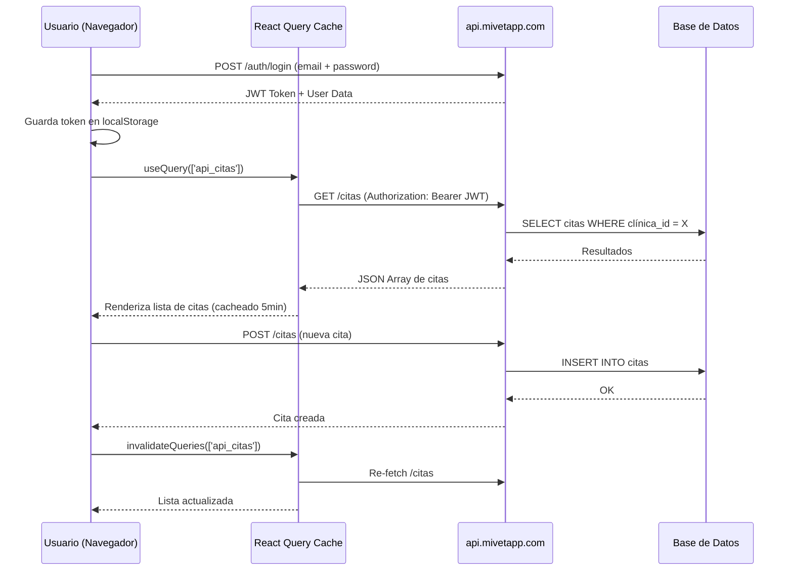
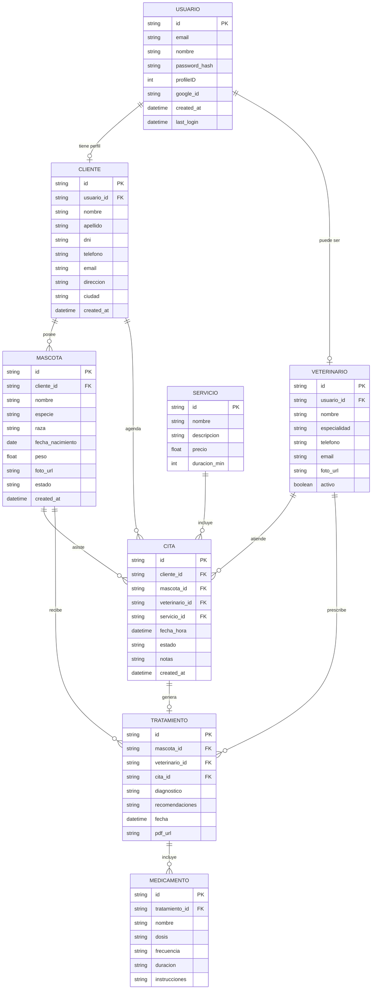
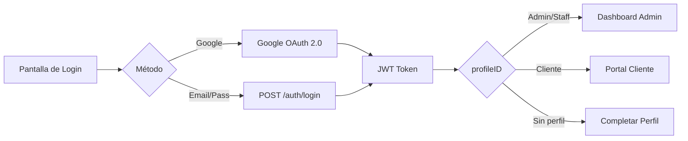
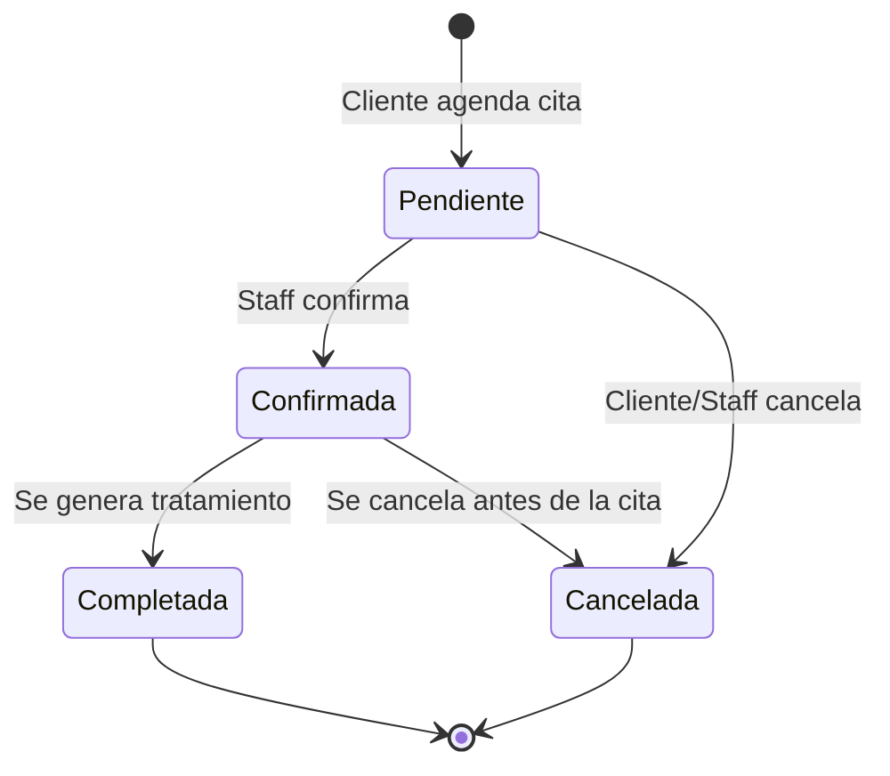
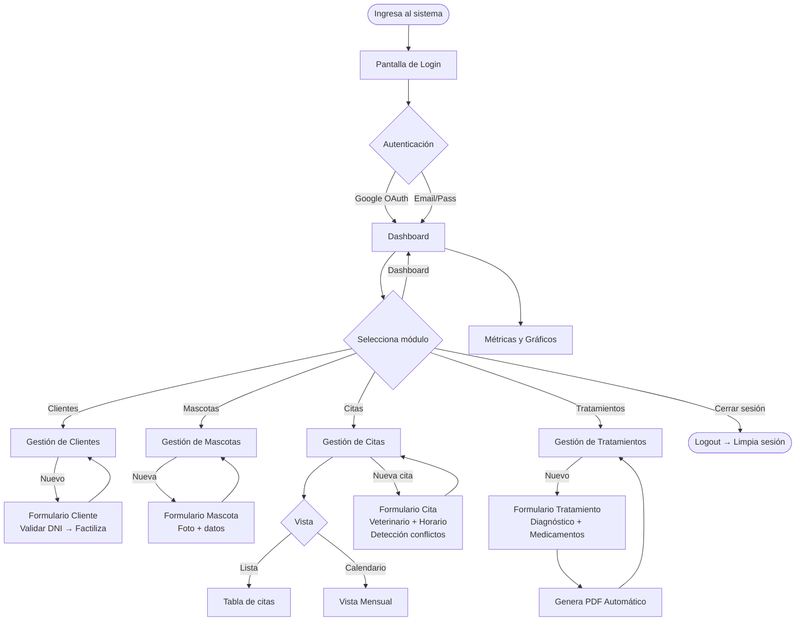
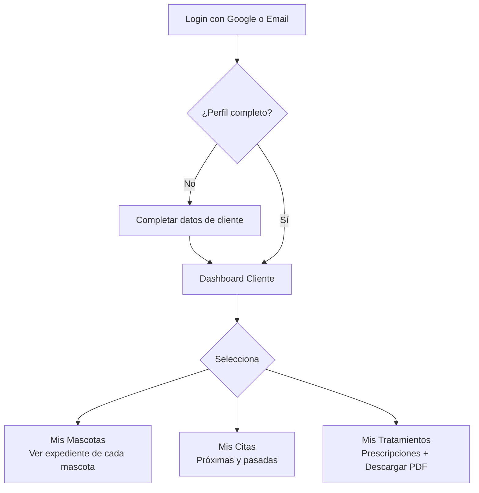
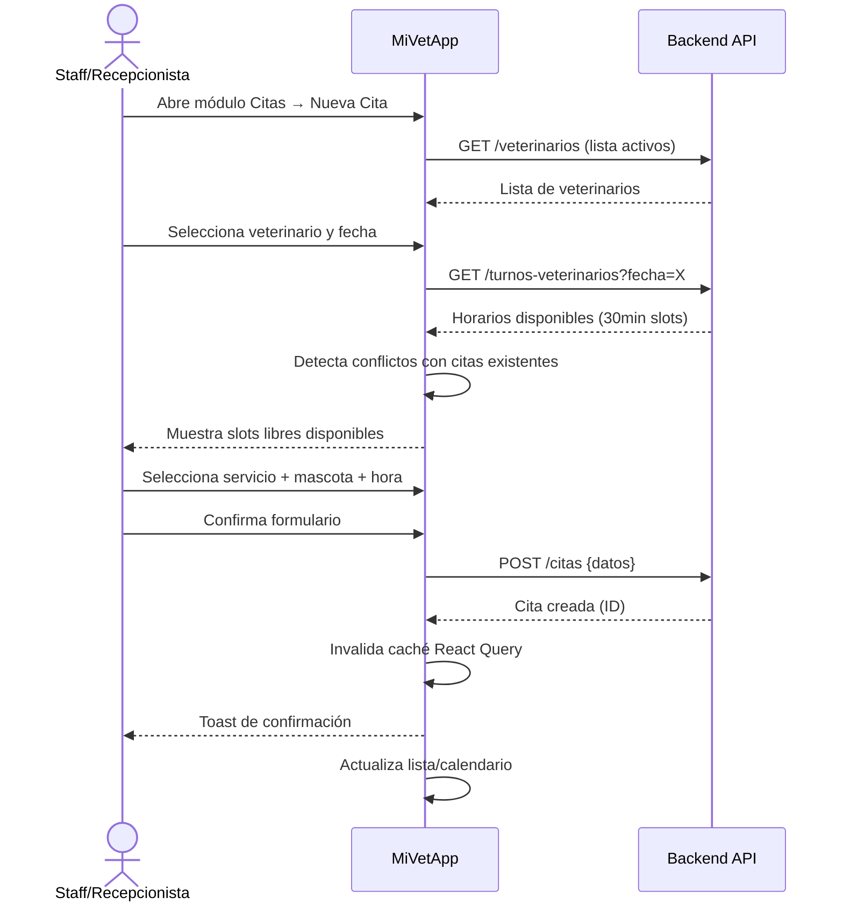
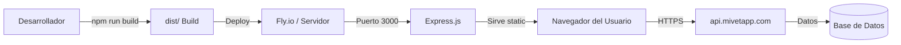

# DOCUMENTACIÓN TÉCNICA — MiVetApp
## Sistema de Gestión para Clínicas Veterinarias

---

> **Autor:** Osmar H.A.
> **Proyecto:** MiVetApp — ProyectoVetAPP2025
> **Tipo:** Aplicación Web Full-Stack (SPA + API REST)
> **Fecha:** Marzo 2026
> **Stack:** React 18 · Node.js · Express · TailwindCSS · Shadcn/ui

---

# TABLA DE CONTENIDOS

1. [Introducción](#1-introducción)
2. [Objetivos](#2-objetivos)
3. [Descripción General del Sistema](#3-descripción-general-del-sistema)
4. [Arquitectura del Sistema](#4-arquitectura-del-sistema)
5. [Tecnologías Utilizadas](#5-tecnologías-utilizadas)
6. [Estructura del Proyecto](#6-estructura-del-proyecto)
7. [Base de Datos y Entidades](#7-base-de-datos-y-entidades)
8. [Funcionalidades Principales](#8-funcionalidades-principales)
9. [Flujo del Usuario](#9-flujo-del-usuario)
10. [Pantallas del Sistema (Mockups)](#10-pantallas-del-sistema-mockups)
11. [Seguridad](#11-seguridad)
12. [Despliegue y Configuración](#12-despliegue-y-configuración)
13. [Conclusiones](#13-conclusiones)
14. [Anexos — Código Relevante](#14-anexos--código-relevante)

---

# 1. INTRODUCCIÓN

## 1.1 Problema que Resuelve

Las clínicas veterinarias pequeñas y medianas enfrentan desafíos operativos críticos:

- **Gestión manual** de fichas de pacientes (mascotas) en papel o planillas
- **Conflictos de agenda** al no tener un sistema de citas centralizado
- **Pérdida del historial clínico** por falta de digitalización
- **Comunicación deficiente** entre veterinarios y dueños de mascotas
- **Sin acceso remoto** para clientes que necesitan consultar información de sus mascotas

Estas ineficiencias generan experiencias negativas para clientes y personal, afectan la calidad del servicio y limitan el crecimiento del negocio.

## 1.2 Contexto

MiVetApp nace como respuesta a esta problemática, ofreciendo una plataforma digital integral para clínicas veterinarias de Perú y Latinoamérica. El sistema digitaliza completamente el ciclo de atención veterinaria: desde el registro del cliente, gestión de mascotas, programación de citas, hasta la emisión de tratamientos con historial clínico y documentos PDF.

## 1.3 Justificación

El mercado veterinario está en crecimiento sostenido. Según estudios de sector, más del 70% de las clínicas veterinarias independientes no cuentan con un sistema de gestión digital propio. MiVetApp llena ese vacío con:

- Tecnología moderna y accesible desde cualquier dispositivo
- Interfaz amigable para personal sin experiencia técnica
- Portal propio para clientes/dueños de mascotas
- Integración con servicios externos (Google OAuth, validación de DNI)
- Generación automática de documentos PDF

---

# 2. OBJETIVOS

## 2.1 Objetivo General

Desarrollar una plataforma web full-stack para la gestión integral de clínicas veterinarias que permita administrar clientes, mascotas, citas, tratamientos y veterinarios desde un entorno digital centralizado, con roles diferenciados para administradores, personal y clientes.

## 2.2 Objetivos Específicos

1. **Implementar autenticación segura** con soporte para Google OAuth 2.0 y credenciales de email/contraseña, con control de sesión de 8 horas.

2. **Desarrollar un módulo de gestión de clientes** con registro, edición, búsqueda y validación de identidad mediante la API de Factiliza (DNI peruano).

3. **Crear un módulo completo de mascotas** que registre especie, raza, edad, peso y foto, asociadas al cliente propietario.

4. **Diseñar un sistema de citas** con vista de calendario y lista, detección de conflictos de horario, selección de veterinario y seguimiento de estados.

5. **Implementar la gestión de tratamientos** con diagnóstico, prescripción de medicamentos y generación de documentos PDF con historial clínico.

6. **Proveer un panel de analíticas** para el administrador con métricas en tiempo real y gráficos de actividad clínica.

7. **Ofrecer un portal cliente** donde los dueños de mascotas puedan consultar sus citas, mascotas y tratamientos de forma autónoma.

8. **Garantizar un diseño responsivo** y accesible, con soporte de modo oscuro y componentes accesibles (WCAG).

---

# 3. DESCRIPCIÓN GENERAL DEL SISTEMA

## 3.1 ¿Qué hace el sistema?

MiVetApp es un **sistema de gestión clínica veterinaria** que cubre el ciclo completo de atención:

| Módulo | Descripción |
|--------|-------------|
| **Autenticación** | Login con Google o email/contraseña, sesiones con expiración |
| **Dashboard Admin** | Métricas del día: citas, pacientes, producción clínica |
| **Clientes** | Registro y gestión de propietarios de mascotas |
| **Mascotas** | Expediente digital por mascota |
| **Citas** | Agenda veterinaria con calendario interactivo |
| **Tratamientos** | Diagnóstico, medicamentos, historial y PDF |
| **Veterinarios** | Gestión del equipo médico |
| **Usuarios** | Administración de accesos y roles |
| **Portal Cliente** | Vista personal del dueño: mis mascotas, citas, tratamientos |
| **Sitio Público** | Landing page de marketing (Inicio, Soluciones, Precios, Casos) |

## 3.2 Tipo de Aplicación

- **Frontend:** Single Page Application (SPA) con React 18
- **Backend:** API REST con Node.js/Express (producción)
- **Despliegue:** Servidor Express sirviendo el build estático de Vite
- **Plataforma:** Web — compatible con PC, tablet y móvil (responsivo)

## 3.3 Público Objetivo

| Perfil | Descripción |
|--------|-------------|
| **Administrador** | Dueño o director de la clínica. Acceso total |
| **Personal / Staff** | Veterinarios, recepcionistas. Acceso operativo |
| **Cliente** | Dueño de mascota. Portal de auto-consulta |

---

# 4. ARQUITECTURA DEL SISTEMA

## 4.1 Patrón Arquitectónico

MiVetApp utiliza una arquitectura **Cliente-Servidor desacoplada** con patrón **SPA (Single Page Application)**:

- El **frontend React** gestiona toda la navegación y UI sin recargas de página.
- El **backend API REST** (alojado en `api.mivetapp.com`) maneja la lógica de negocio y persistencia.
- El **servidor Express** en producción actúa como servidor de archivos estáticos con fallback SPA.
- La gestión de estado del servidor se delega a **TanStack React Query** (caché, sincronización, invalidación).

## 4.2 Diagrama de Arquitectura

```mermaid
graph TB
    subgraph "Cliente — Navegador"
        UI[React SPA<br/>Vite + React 18]
        RQ[TanStack React Query<br/>Estado del Servidor]
        RR[React Router v7<br/>Navegación SPA]
        UI --> RQ
        UI --> RR
    end

    subgraph "Servidor de Producción"
        EXP[Express.js<br/>Puerto 3000]
        DIST[dist/ — Build Estático]
        EXP --> DIST
    end

    subgraph "API REST Externa"
        API[api.mivetapp.com/api]
        AUTH_EP[/auth/me]
        CRUD_EP[/clientes /mascotas<br/>/citas /tratamientos]
        EMAIL_EP[/email/bienvenida]
        UPLOAD_EP[/upload]
        API --> AUTH_EP
        API --> CRUD_EP
        API --> EMAIL_EP
        API --> UPLOAD_EP
    end

    subgraph "Servicios Externos"
        GOOGLE[Google OAuth 2.0<br/>Autenticación]
        FACTILIZA[Factiliza API<br/>Validación DNI]
        PDF[jsPDF + html2canvas<br/>Generación PDF]
    end

    UI -->|HTTP Bearer Token| API
    UI -->|OAuth 2.0| GOOGLE
    UI -->|DNI Query| FACTILIZA
    UI -->|Genera localmente| PDF
    EXP -->|Sirve| UI

    style UI fill:#5E56A3,color:#fff
    style API fill:#2D6CDF,color:#fff
    style GOOGLE fill:#E24A4A,color:#fff
    style FACTILIZA fill:#2EAE6B,color:#fff
```

## 4.3 Flujo de Datos



## 4.4 Gestión de Estado

| Tipo de Estado | Herramienta |
|----------------|-------------|
| Estado del servidor (API) | TanStack React Query |
| Estado de sesión | localStorage + SessionManager |
| Estado de UI local | useState / useReducer |
| Estado de formularios | React Hook Form + Zod |
| Navegación | React Router v7 |

---

# 5. TECNOLOGÍAS UTILIZADAS

## 5.1 Frontend

| Tecnología | Versión | Rol |
|------------|---------|-----|
| **React** | 18.2.0 | Librería UI principal |
| **Vite** | 6.1.0 | Bundler y servidor de desarrollo |
| **React Router DOM** | 7.2.0 | Enrutamiento SPA |
| **TanStack React Query** | 5.90.9 | Gestión de estado del servidor |
| **React Hook Form** | 7.54.2 | Manejo de formularios |
| **Zod** | 3.24.2 | Validación de esquemas |
| **Framer Motion** | 12.4.7 | Animaciones |
| **date-fns** | 3.6.0 | Manipulación de fechas |

## 5.2 UI & Diseño

| Tecnología | Versión | Rol |
|------------|---------|-----|
| **Tailwind CSS** | 3.4.17 | Framework CSS utilitario |
| **Shadcn/ui** | N/A | Sistema de componentes (60+ componentes) |
| **Radix UI** | Multiple | Primitivos accesibles |
| **Lucide React** | 0.475.0 | Iconografía |
| **Embla Carousel** | 8.5.2 | Carrusel de imágenes |
| **Sonner** | 2.0.1 | Notificaciones Toast |

## 5.3 Backend y Servidor

| Tecnología | Versión | Rol |
|------------|---------|-----|
| **Node.js** | LTS | Entorno de ejecución |
| **Express.js** | 4.18.2 | Servidor de archivos estáticos |
| **CORS** | 2.8.5 | Control de origen cruzado |

## 5.4 Generación de Documentos

| Tecnología | Rol |
|------------|-----|
| **jsPDF** 3.0.3 | Generación de PDFs en el cliente |
| **html2canvas** 1.4.1 | Captura de DOM para PDF |

## 5.5 Servicios Externos

| Servicio | Uso |
|----------|-----|
| **Google OAuth 2.0** | Autenticación con cuenta Google |
| **Factiliza API** | Validación y consulta de DNI peruano |
| **api.mivetapp.com** | Backend principal con lógica y base de datos |

## 5.6 Herramientas de Desarrollo

| Herramienta | Uso |
|-------------|-----|
| **ESLint** | Linting de código JavaScript/JSX |
| **PostCSS** | Procesamiento CSS |
| **jsconfig.json** | Alias de rutas (`@` → `./src`) |

---

# 6. ESTRUCTURA DEL PROYECTO

## 6.1 Árbol de Directorios

```mermaid
graph TD
    ROOT[ProyectoVetAPP2025/]
    ROOT --> SRC[src/]
    ROOT --> PUBLIC[public/]
    ROOT --> DIST[dist/]
    ROOT --> CFG[Archivos de Config]

    SRC --> API_DIR[api/]
    SRC --> COMP[components/]
    SRC --> HOOKS[hooks/]
    SRC --> LIB[lib/]
    SRC --> PAGES[pages/]
    SRC --> UTILS[utils/]

    API_DIR --> B44[base44Client.js<br/>Cliente HTTP + CRUD]
    API_DIR --> ENT[entities.js<br/>Exporta entidades]
    API_DIR --> INTEG[integrations.js<br/>Upload de archivos]

    COMP --> AUTH_C[auth/<br/>SessionTimeoutManager]
    COMP --> CITAS_C[citas/<br/>CitaForm CitasList CitasCalendar]
    COMP --> CLI_C[clientes/<br/>ClienteForm]
    COMP --> MAS_C[mascotas/<br/>MascotaCard MascotaForm]
    COMP --> TRA_C[tratamientos/<br/>HistorialClinico TratamientoCard TratamientoForm]
    COMP --> VET_C[veterinarios/<br/>VeterinarioCard VeterinarioForm]
    COMP --> UI_C[ui/<br/>60+ Componentes Shadcn]

    PAGES --> ADMIN_P[Dashboard Clientes Mascotas<br/>Citas Tratamientos Veterinarios Usuarios]
    PAGES --> CLIENT_P[MisMascotas MisCitas MisTratamientos<br/>ClienteDashboard]
    PAGES --> SHARED_P[Login Layout Servicios CompletarCliente]
    PAGES --> SITE_P[site/<br/>HomePage SolutionsPage PricingPage<br/>CaseStudiesPage ContactPage]

    LIB --> API_LIB[api.js — URL base]
    LIB --> SESSION[session.js — Timeout 8h]
    LIB --> PDF_LIB[historialPdf.js — PDF storage]
    LIB --> UTILS_L[utils.js — Tailwind merge]

    style ROOT fill:#5E56A3,color:#fff
    style SRC fill:#2D6CDF,color:#fff
    style COMP fill:#2EAE6B,color:#fff
    style PAGES fill:#2EAE6B,color:#fff
```



## 6.2 Rol de Cada Módulo

| Módulo | Ruta | Responsabilidad |
|--------|------|-----------------|
| `api/base44Client.js` | Capa API | Centraliza todas las llamadas HTTP con autenticación Bearer |
| `api/entities.js` | Capa API | Exporta las entidades del dominio (Cliente, Mascota, Cita…) |
| `components/citas/` | Presentación | Formulario, lista y calendario de citas |
| `components/clientes/` | Presentación | Formulario de registro/edición de clientes |
| `components/mascotas/` | Presentación | Tarjeta y formulario de mascotas |
| `components/tratamientos/` | Presentación | Historial clínico, tarjeta y formulario de tratamientos |
| `components/veterinarios/` | Presentación | Tarjeta y formulario de veterinarios |
| `components/auth/` | Sesión | Gestor de timeout de sesión con modal de confirmación |
| `components/ui/` | Design System | 60+ componentes reutilizables (Shadcn/ui) |
| `pages/` | Rutas | Páginas completas montadas por el router |
| `pages/site/` | Marketing | Landing page pública (no requiere autenticación) |
| `lib/api.js` | Config | URL base de la API (configurable por `.env`) |
| `lib/session.js` | Seguridad | Lógica de timeout de sesión (8 horas) |
| `lib/historialPdf.js` | Documentos | Gestión de URLs de PDFs generados |
| `server.js` | Producción | Servidor Express que sirve el build estático |

---

# 7. BASE DE DATOS Y ENTIDADES

## 7.1 Diagrama Entidad-Relación



## 7.2 Descripción de Entidades Principales

### USUARIO
Gestiona los accesos al sistema. El campo `profileID` determina el rol:
- `1` → Administrador (acceso total)
- `2-4` → Staff/Personal (acceso operativo)
- `5` → Cliente (portal de auto-consulta)

### CLIENTE
Propietario de una o más mascotas. Se valida el DNI a través de la API Factiliza para auto-completar nombres y dirección. Puede tener un usuario asociado para acceder al portal.

### MASCOTA
Expediente digital de la mascota. Incluye datos biométricos (peso, especie, raza), foto y estado clínico. Está siempre vinculada a un cliente propietario.

### CITA
Registro de agenda con control de estado: `Pendiente → Confirmada → Completada | Cancelada`. Vincula mascota, veterinario y servicio. El sistema detecta conflictos de horario automáticamente.

### TRATAMIENTO
Resultado clínico de una cita. Incluye diagnóstico y prescripción de medicamentos. Genera un documento PDF que queda almacenado en el historial de la mascota.

### MEDICAMENTO
Detalle de cada fármaco prescrito dentro de un tratamiento (nombre, dosis, frecuencia, duración, instrucciones).

---

# 8. FUNCIONALIDADES PRINCIPALES

## 8.1 Autenticación y Control de Acceso



**Características:**
- Google OAuth 2.0 con redirección automática
- Email + contraseña con validación Zod
- JWT almacenado en `localStorage`
- Sesión de **8 horas** con renovación modal
- Logout limpia token, datos de usuario y última ruta

## 8.2 Gestión de Clientes

| Operación | Descripción |
|-----------|-------------|
| **Crear** | Formulario completo con validación; auto-relleno por DNI vía Factiliza |
| **Leer** | Tabla paginada con búsqueda por nombre/DNI |
| **Actualizar** | Edición inline en modal Dialog |
| **Eliminar** | Con confirmación de AlertDialog |

**Integración especial — DNI Lookup:**
- Ingresa el DNI peruano → consulta Factiliza API
- Auto-completa: nombre, apellido, dirección
- Reduce errores de digitación y tiempo de registro

## 8.3 Gestión de Mascotas

| Campo | Tipo | Descripción |
|-------|------|-------------|
| Nombre | Texto | Nombre de la mascota |
| Especie | Select | Perro, Gato, Ave, Conejo, etc. |
| Raza | Texto | Raza específica |
| Fecha nacimiento | Date | Calcula edad automáticamente |
| Peso | Número | En kilogramos |
| Foto | Upload | Sube imagen, guarda URL |
| Estado | Select | Activo, Inactivo, Fallecido |
| Propietario | Select | Vincula al cliente |

## 8.4 Sistema de Citas



**Características del calendario:**
- Vista lista y vista calendario mensual interactivo
- Slots de 30 minutos entre 8:00 AM y 8:00 PM
- Filtrado por veterinario, fecha y estado
- Detección automática de conflictos de horario
- Selección de servicio con duración y precio

## 8.5 Gestión de Tratamientos

**Flujo de prescripción:**
1. Selecciona la mascota y cita relacionada
2. Ingresa diagnóstico y recomendaciones
3. Agrega medicamentos (nombre, dosis, frecuencia, duración)
4. El sistema genera automáticamente un **documento PDF**
5. El PDF queda disponible en el historial clínico de la mascota

**PDF generado incluye:**
- Datos de la clínica y veterinario
- Ficha del paciente (mascota y propietario)
- Diagnóstico clínico
- Lista de medicamentos prescrita
- Fecha y firma

## 8.6 Dashboard Administrativo

El dashboard presenta en tiempo real:

| Métrica | Descripción |
|---------|-------------|
| Citas de hoy | Conteo con detalle por hora |
| Citas pendientes | Pendientes de confirmar |
| Total clientes | Clientes registrados |
| Total mascotas | Pacientes activos |
| Agenda prioritaria | Próximas 5 citas del día |
| Citas por estado | Gráfico de dona |
| Distribución por especie | Gráfico de barras |
| Evolución mensual | Gráfico de línea |

## 8.7 Portal del Cliente

El cliente con perfil `profileID=5` accede a su panel exclusivo:
- **Mis Mascotas** — lista de sus mascotas con expediente
- **Mis Citas** — historial y próximas citas
- **Mis Tratamientos** — prescripciones recibidas con opción de descargar PDF

---

# 9. FLUJO DEL USUARIO

## 9.1 Flujo Completo — Administrador



## 9.2 Flujo del Cliente (Portal)



## 9.3 Flujo de Agendamiento de Cita



---

# 10. PANTALLAS DEL SISTEMA (MOCKUPS)

## 10.1 Pantalla de Login

```
┌─────────────────────────────────────────────────────────┐
│  ┌─────────────┐   ┌──────────────────────────────────┐ │
│  │             │   │    🐾 MiVetApp                   │ │
│  │  [Imagen    │   │                                  │ │
│  │   clínica   │   │  Bienvenido al sistema           │ │
│  │   veterina- │   │  de gestión veterinaria          │ │
│  │   ria]      │   │                                  │ │
│  │             │   │  ┌─────────────────────────────┐ │ │
│  │             │   │  │  [G] Continuar con Google   │ │ │
│  │             │   │  └─────────────────────────────┘ │ │
│  │             │   │                ───── o ─────     │ │
│  │             │   │  Email:  [___________________]   │ │
│  │             │   │  Contraseña: [_______________]   │ │
│  │             │   │  [      Iniciar Sesión      ]    │ │
│  └─────────────┘   └──────────────────────────────────┘ │
└─────────────────────────────────────────────────────────┘
```
**Descripción:** Pantalla dividida en dos secciones. A la izquierda, imagen de la clínica. A la derecha, formulario con opciones de Google OAuth y email/contraseña. Valida campos con Zod antes de enviar.

---

## 10.2 Dashboard Administrativo

```
┌──────────────────────────────────────────────────────────────┐
│ 🐾 MiVetApp  │  Dashboard                    [👤 Admin]  [⚙] │
├─────────────┬────────────────────────────────────────────────┤
│ 🏠 Dashboard│  📊 RESUMEN DEL DÍA                            │
│ 👥 Clientes │  ┌──────────┐ ┌──────────┐ ┌──────────┐       │
│ 🐕 Mascotas │  │ Citas    │ │Pendientes│ │ Clientes │       │
│ 📅 Citas    │  │  Hoy: 8  │ │    3     │ │   142    │       │
│ 💊 Tratam.  │  └──────────┘ └──────────┘ └──────────┘       │
│ 👨‍⚕️ Vets     │                                                │
│ 👤 Usuarios │  📈 GRÁFICOS                                    │
│             │  ┌───────────────────┐ ┌──────────────────┐   │
│             │  │ Citas por estado  │ │ Especie pacientes│   │
│             │  │    [Dona Chart]   │ │   [Bar Chart]    │   │
│             │  └───────────────────┘ └──────────────────┘   │
│             │                                                │
│             │  📋 AGENDA PRIORITARIA (Próximas 5 citas)      │
│             │  ┌─────────────────────────────────────────┐  │
│             │  │ 09:00 │ Max (🐕) │ Dr. García │ Vacuna  │  │
│             │  │ 10:30 │ Luna(🐱) │ Dr. López  │ Control │  │
│             │  └─────────────────────────────────────────┘  │
└─────────────┴────────────────────────────────────────────────┘
```
**Descripción:** Layout con sidebar de navegación y área principal con tarjetas de métricas, dos gráficos (estado de citas por estado en dona, distribución por especie en barras) y agenda prioritaria del día.

---

## 10.3 Gestión de Citas — Vista Calendario

```
┌──────────────────────────────────────────────────────────────┐
│  Citas Veterinarias               [Lista] [Calendario] [+ Nueva]│
├──────────────────────────────────────────────────────────────┤
│  ◀ Febrero 2026  ▶         Filtrar: [Todos los vets ▼]       │
│  ┌────┬────┬────┬────┬────┬────┬────┐                        │
│  │ Lu │ Ma │ Mi │ Ju │ Vi │ Sa │ Do │                        │
│  ├────┼────┼────┼────┼────┼────┼────┤                        │
│  │  2 │  3 │  4 │  5 │  6 │  7 │  8 │                        │
│  │    │ 🟢 │    │ 🟡 │ 🔵 │    │    │                        │
│  ├────┼────┼────┼────┼────┼────┼────┤                        │
│  │  9 │ 10 │ 11 │ 12 │ 13 │ 14 │ 15 │                        │
│  │ 🔵 │    │ 🟢 │    │ 🟡 │    │    │                        │
│  └────┴────┴────┴────┴────┴────┴────┘                        │
│  🟢 Confirmada  🟡 Pendiente  🔵 Completada  🔴 Cancelada     │
└──────────────────────────────────────────────────────────────┘
```
**Descripción:** Vista de calendario mensual con indicadores de color por estado de cita. Permite navegar entre meses y filtrar por veterinario. Al hacer clic en un día se muestran las citas del día en un panel lateral.

---

## 10.4 Formulario de Nueva Cita

```
┌─────────────────────────────────────────────────┐
│  Nueva Cita                                  [X] │
├─────────────────────────────────────────────────┤
│                                                  │
│  Cliente:      [Seleccionar cliente...    ▼]    │
│  Mascota:      [Seleccionar mascota...    ▼]    │
│  Veterinario:  [Dr. García                ▼]    │
│  Servicio:     [Consulta General          ▼]    │
│                                                  │
│  Fecha:        [📅 15/02/2026              ]    │
│  Hora:         [ 09:00 ] [ 09:30 ] [✓10:00]    │
│               [ 10:30 ] [ 11:00 ] [ 11:30]     │
│               [Slots disponibles marcados ✓]   │
│                                                  │
│  Notas adicionales:                             │
│  [_____________________________________________] │
│                                                  │
│  ⚠ Sin conflictos detectados                    │
│                                                  │
│  [Cancelar]              [Guardar Cita]         │
└─────────────────────────────────────────────────┘
```
**Descripción:** Modal de creación de cita con selección dinámica de cliente→mascota, veterinario y servicio. Muestra la grilla de horarios disponibles (eliminando slots ocupados). Alerta si hay conflictos de horario.

---

## 10.5 Expediente de Mascota

```
┌──────────────────────────────────────────────────────┐
│  🐕 MAX — Labrador Dorado                            │
│  ──────────────────────────────────────────────────  │
│  ┌──────────┐  Propietario: Juan Pérez              │
│  │  [Foto   │  Teléfono: 987 654 321               │
│  │  Mascota]│  Especie: Perro | Raza: Labrador     │
│  │          │  Edad: 3 años | Peso: 28 kg          │
│  └──────────┘  Estado: 🟢 Activo                    │
│                                                      │
│  📋 HISTORIAL CLÍNICO (4 tratamientos)              │
│  ┌────────────────────────────────────────────────┐ │
│  │ 15/01/26 │ Vacunación anual    │ Dr. García    │ │
│  │ 22/11/25 │ Control rutinario   │ Dr. López     │ │
│  │ 03/09/25 │ Dermatitis alérgica │ Dr. García    │ │
│  └────────────────────────────────────────────────┘ │
│  [📄 Ver PDF]  [+ Nuevo Tratamiento]  [✏ Editar]   │
└──────────────────────────────────────────────────────┘
```
**Descripción:** Vista completa del expediente de una mascota con foto, datos biométricos, propietario y listado de tratamientos. Acceso directo para ver PDFs del historial clínico.

---

## 10.6 Portal Cliente — Mis Mascotas

```
┌──────────────────────────────────────────────┐
│ 🐾 MiVetApp       Hola, Juan!        [Salir] │
├──────────────────────────────────────────────┤
│ 🐾 Mis Mascotas  │ 📅 Mis Citas │ 💊 Mis Trat│
├──────────────────────────────────────────────┤
│                                              │
│  MIS MASCOTAS                                │
│  ┌──────────────┐  ┌──────────────┐         │
│  │  [📷 Foto]   │  │  [📷 Foto]   │         │
│  │  Max         │  │  Luna        │         │
│  │  🐕 Labrador │  │  🐱 Siamés   │         │
│  │  3 años, 28kg│  │  2 años, 4kg │         │
│  │  🟢 Activo   │  │  🟢 Activo   │         │
│  │  [Ver detalle│  │  [Ver detalle│         │
│  └──────────────┘  └──────────────┘         │
│                                              │
│  Próxima cita: Max — 15/03/2026 10:00 AM    │
└──────────────────────────────────────────────┘
```
**Descripción:** Portal simplificado para clientes (dueños de mascotas). Muestra sus mascotas en tarjetas con foto y datos básicos. Solo lectura — sin opciones de modificación de datos clínicos.

---

# 11. SEGURIDAD

## 11.1 Protección de Datos

| Mecanismo | Implementación |
|-----------|----------------|
| **Autenticación** | JWT Bearer Token en headers HTTP |
| **Control de sesión** | Expiración de 8 horas con renovación modal |
| **Logout seguro** | Limpia token, datos de usuario y última ruta de localStorage |
| **OAuth** | Google OAuth 2.0 — contraseña nunca pasa por la app |

## 11.2 Control de Acceso (RBAC)

```mermaid
graph LR
    subgraph "Rutas Públicas"
        PUB[/ /login /soluciones /precios /casos /contacto]
    end

    subgraph "Rutas Admin/Staff"
        ADM[/dashboard /clientes /mascotas /citas /tratamientos /veterinarios /usuarios]
    end

    subgraph "Rutas Cliente"
        CLI[/mismascotas /miscitas /mistratamientos]
    end

    ADMIN[profileID 1-4<br/>Admin/Staff] --> PUB
    ADMIN --> ADM
    CLIENT[profileID 5<br/>Cliente] --> PUB
    CLIENT --> CLI
    CLIENT -->|BLOQUEADO| ADM
    ADMIN -->|BLOQUEADO| CLI
```

## 11.3 Validaciones Backend

- Todos los endpoints requieren **Bearer Token válido** en el header `Authorization`
- Los datos de formularios se validan con **esquemas Zod** antes de ser enviados a la API
- Los campos obligatorios son validados en el frontend con React Hook Form
- Los archivos subidos pasan por el endpoint `/upload` dedicado

## 11.4 Consideraciones de Mejora

| Riesgo | Nivel | Recomendación |
|--------|-------|---------------|
| Token Factiliza hardcodeado en código fuente | Medio | Mover a variable de entorno `VITE_FACTILIZA_TOKEN` |
| JWT en `localStorage` (vulnerable a XSS) | Medio | Evaluar `httpOnly` cookies con SameSite |
| Sin rate limiting client-side visible | Bajo | Implementar en el backend de la API |
| CORS configurado en Express | Bajo | Verificar dominios permitidos en producción |

---

# 12. DESPLIEGUE Y CONFIGURACIÓN

## 12.1 Variables de Entorno

```env
# URL base del backend API
VITE_API_BASE_URL=https://api.mivetapp.com/api

# Google OAuth
VITE_GOOGLE_CLIENT_ID=820224466502-xxx.apps.googleusercontent.com

# Endpoints personalizados
VITE_CLIENTE_CREATE_ENDPOINT=https://api.mivetapp.com/api/clientes
VITE_WELCOME_EMAIL_ENDPOINT=https://api.mivetapp.com/api/email/bienvenida
```

## 12.2 Comandos de Desarrollo

```bash
# Instalar dependencias
npm install

# Servidor de desarrollo (http://localhost:5173)
npm run dev

# Construir para producción
npm run build

# Servir build de producción (http://localhost:3000)
npm start

# Linting
npm run lint
```

## 12.3 Plataforma de Despliegue

El proyecto incluye un `Procfile` configurado para **Fly.io**:

```
web: node server.js
```

El servidor Express en `server.js` sirve el directorio `dist/` con fallback SPA para todas las rutas, permitiendo que React Router maneje la navegación client-side.

## 12.4 Diagrama de Despliegue



---

# 13. CONCLUSIONES

## 13.1 Beneficios del Sistema

| Beneficio | Impacto |
|-----------|---------|
| **Digitalización completa** | Elimina el uso de fichas en papel y planillas manuales |
| **Eficiencia operativa** | Reduce el tiempo de registro de clientes con auto-llenado por DNI |
| **Trazabilidad clínica** | Historial completo por mascota con PDFs descargables |
| **Satisfacción del cliente** | Portal de auto-consulta disponible 24/7 |
| **Visibilidad gerencial** | Dashboard con métricas en tiempo real para toma de decisiones |
| **Reducción de conflictos** | Detección automática de choques de horario en el calendario de citas |
| **Acceso multiplataforma** | Responsivo para PC, tablet y móvil |

## 13.2 Escalabilidad

La arquitectura elegida es **altamente escalable**:

- **Horizontal:** El frontend estático puede servirse desde CDN (Vercel, Cloudflare Pages)
- **Separación de capas:** El backend API puede escalar independientemente del frontend
- **React Query:** La capa de caché reduce la carga en el servidor para datos frecuentes
- **Componentes modulares:** Nuevas entidades pueden añadirse con mínimo esfuerzo (nuevo endpoint + entidad + página)

## 13.3 Posibles Mejoras Futuras

| Mejora | Prioridad | Descripción |
|--------|-----------|-------------|
| **Notificaciones push** | Alta | Recordatorios de citas por WhatsApp/SMS |
| **App móvil nativa** | Alta | React Native reutilizando la lógica de negocio |
| **Módulo de facturación** | Media | Emitir boletas y facturas electrónicas |
| **Telemedicina** | Media | Videollamadas integradas para consultas remotas |
| **IA diagnóstica** | Baja | Asistente con sugerencias de diagnóstico por síntomas |
| **Multi-clínica** | Media | Soporte para franquicias con panel centralizado |
| **Inventario de medicamentos** | Media | Control de stock de medicamentos en la clínica |
| **API pública** | Baja | Para integraciones con otros sistemas veterinarios |

---

# 14. ANEXOS — CÓDIGO RELEVANTE

## 14.1 Cliente HTTP Centralizado (`src/api/base44Client.js`)

```javascript
// URL base configurable desde variables de entorno
const API_BASE_URL = import.meta.env.VITE_API_BASE_URL || 'https://api.mivetapp.com/api';

// Función de petición base con autenticación automática
async function apiRequest(endpoint, method = 'GET', data = null) {
  const token = localStorage.getItem('auth_token');
  const headers = {
    'Content-Type': 'application/json',
    ...(token && { 'Authorization': `Bearer ${token}` })
  };
  // ...
}

// CRUD genérico para cualquier entidad
const createEntityCRUD = (entityName) => ({
  list: (params) => apiRequest(`/${entityName}`, 'GET', params),
  create: (data) => apiRequest(`/${entityName}`, 'POST', data),
  update: (id, data) => apiRequest(`/${entityName}/${id}`, 'PUT', data),
  delete: (id) => apiRequest(`/${entityName}/${id}`, 'DELETE'),
  get: (id) => apiRequest(`/${entityName}/${id}`, 'GET'),
});
```

**Explicación:** El cliente centraliza todas las llamadas HTTP. Automáticamente añade el Bearer Token de `localStorage` a cada solicitud. El patrón `createEntityCRUD` genera operaciones CRUD para cualquier entidad con una sola línea de configuración.

---

## 14.2 Gestión de Sesión (`src/lib/session.js`)

```javascript
const SESSION_DURATION = 8 * 60 * 60 * 1000; // 8 horas en ms
const CONFIRMATION_TIMEOUT = 10 * 1000;        // 10 segundos para confirmar

export const isSessionValid = () => {
  const startTime = localStorage.getItem('auth_session_started_at');
  if (!startTime) return false;
  return (Date.now() - parseInt(startTime)) < SESSION_DURATION;
};

export const renewSession = () => {
  localStorage.setItem('auth_session_last_confirmed_at', Date.now().toString());
};
```

**Explicación:** La sesión se gestiona mediante timestamps en `localStorage`. El componente `SessionTimeoutManager` monitorea continuamente la validez y muestra un modal de advertencia 10 segundos antes de expirar, dando al usuario la opción de renovar o cerrar sesión.

---

## 14.3 Configuración de Rutas con Control de Acceso (`src/pages/index.jsx`)

```javascript
// Rutas protegidas solo para Admin/Staff (deniega clientes)
const adminRoutes = [
  { path: '/dashboard', element: <Dashboard />, denyClients: true },
  { path: '/clientes', element: <Clientes />, denyClients: true },
  { path: '/mascotas', element: <Mascotas />, denyClients: true },
  // ...
];

// Rutas exclusivas para clientes
const clientRoutes = [
  { path: '/mismascotas', element: <MisMascotas />, clientOnly: true },
  { path: '/miscitas', element: <MisCitas />, clientOnly: true },
  // ...
];

// HOC de protección de ruta
const ProtectedRoute = ({ element, denyClients, clientOnly }) => {
  const user = JSON.parse(localStorage.getItem('auth_user') || '{}');
  const isClient = user.profileID === 5;

  if (!user.id) return <Navigate to="/login" />;
  if (denyClients && isClient) return <Navigate to="/mismascotas" />;
  if (clientOnly && !isClient) return <Navigate to="/dashboard" />;

  return element;
};
```

**Explicación:** El sistema de rutas implementa RBAC (Role-Based Access Control). El `ProtectedRoute` HOC verifica el `profileID` del usuario almacenado en `localStorage` y redirige según el rol, sin necesidad de llamadas adicionales a la API.

---

## 14.4 Detección de Conflictos de Citas

```javascript
// En CitaForm.jsx — Genera slots disponibles filtrando citas existentes
const getAvailableSlots = (citasExistentes, fechaSeleccionada, veterinarioId) => {
  const slots = [];
  const horaInicio = 8, horaFin = 20;

  for (let hora = horaInicio; hora < horaFin; hora++) {
    for (let min of [0, 30]) {
      const slot = `${hora.toString().padStart(2,'0')}:${min.toString().padStart(2,'0')}`;

      // Verificar si el slot está ocupado
      const ocupado = citasExistentes.some(cita =>
        cita.veterinario_id === veterinarioId &&
        cita.fecha === fechaSeleccionada &&
        cita.hora === slot &&
        cita.estado !== 'Cancelada' // Las canceladas liberan el slot
      );

      if (!ocupado) slots.push(slot);
    }
  }
  return slots; // Retorna solo slots disponibles
};
```

**Explicación:** Genera automáticamente la grilla de 30 minutos entre 8:00 AM y 8:00 PM, filtrando los horarios ya ocupados por el veterinario seleccionado en la fecha elegida. Las citas canceladas devuelven su slot al pool disponible.

---

## 14.5 Generación de PDF con jsPDF

```javascript
// En HistorialClinico.jsx / historialPdf.js
import jsPDF from 'jspdf';
import html2canvas from 'html2canvas';

export const generarPDFTratamiento = async (tratamiento, mascota, veterinario) => {
  const doc = new jsPDF();

  // Cabecera
  doc.setFontSize(18);
  doc.text('MiVetApp — Prescripción Médica', 20, 20);

  // Datos del paciente
  doc.setFontSize(12);
  doc.text(`Paciente: ${mascota.nombre} (${mascota.especie})`, 20, 40);
  doc.text(`Propietario: ${mascota.cliente_nombre}`, 20, 50);
  doc.text(`Veterinario: ${veterinario.nombre}`, 20, 60);
  doc.text(`Fecha: ${format(new Date(tratamiento.fecha), 'dd/MM/yyyy')}`, 20, 70);

  // Diagnóstico
  doc.setFontSize(14);
  doc.text('Diagnóstico:', 20, 90);
  doc.setFontSize(12);
  doc.text(tratamiento.diagnostico, 20, 100);

  // Medicamentos
  doc.setFontSize(14);
  doc.text('Medicamentos Prescritos:', 20, 120);
  tratamiento.medicamentos.forEach((med, i) => {
    doc.text(`${i+1}. ${med.nombre} — ${med.dosis} — ${med.frecuencia}`, 25, 135 + i*15);
  });

  // Descargar
  doc.save(`tratamiento_${mascota.nombre}_${format(new Date(), 'yyyyMMdd')}.pdf`);
};
```

**Explicación:** Genera el PDF completamente en el cliente (sin servidor). Usa `jsPDF` para construir el documento programáticamente con datos del tratamiento, mascota, veterinario y lista de medicamentos. El archivo se descarga automáticamente con nombre descriptivo.

---

## 14.6 Recomendaciones Técnicas

| Área | Recomendación |
|------|---------------|
| **Seguridad** | Mover el token de Factiliza a una variable de entorno protegida. Considerar un proxy backend para las llamadas a APIs externas. |
| **Autenticación** | Evaluar migración de JWT en `localStorage` a cookies `httpOnly` + `SameSite=Strict` para mayor protección contra XSS. |
| **Performance** | Implementar virtualización (`react-virtual`) en tablas con más de 100 registros. |
| **Testing** | Agregar pruebas unitarias con Vitest y pruebas E2E con Playwright para los flujos críticos. |
| **Monitoreo** | Integrar Sentry para captura de errores en producción. |
| **CI/CD** | Configurar GitHub Actions para build automático y despliegue en Fly.io en cada push a `main`. |
| **Caché** | Configurar staleTime y gcTime en React Query según la frecuencia de actualización de cada entidad. |
| **Accesibilidad** | Auditar con axe-core para garantizar cumplimiento WCAG 2.1 AA completo. |

---

*Documentación generada el 2 de Marzo de 2026*
*MiVetApp — Sistema de Gestión para Clínicas Veterinarias*
*Desarrollado con React 18 · Node.js · Tailwind CSS · Shadcn/ui*
